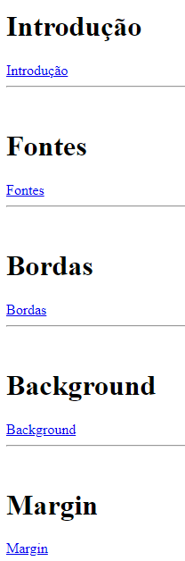
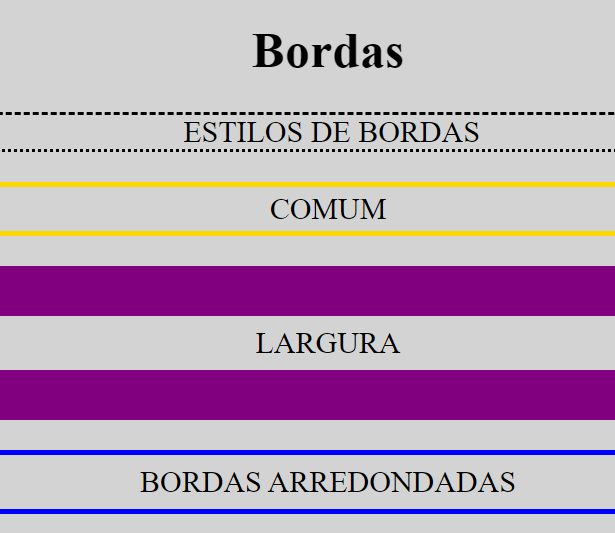

<h1 align="center"> CSS COURSE </h1>

Free course promoted by Bro Code to teach CSS  
<a href="https://www.youtube.com/watch?v=wRNinF7YQqQ">Study this project in video format by clicking here.</a>

  <a href="#-topics">Topics</a>&nbsp;&nbsp;&nbsp;|&nbsp;&nbsp;&nbsp;
  <a href="#-project">Project</a>&nbsp;&nbsp;&nbsp;|&nbsp;&nbsp;&nbsp;
  <a href="#memo-License">License</a>

  

 

  
  

## 🚀 Topics

This project covered the following topics:

- Fonts :cool:
- Borders :black_square_button:
- Position :dart:
- Icons :house:
- Transform :arrows_counterclockwise:
- ...

## 💻 Project

This CSS course contains a lot of information about this essential language for devs.

- [Access the finished project, online](https://aoba43.github.io/CSS-course/)

- [Watch class](https://www.youtube.com/watch?v=wRNinF7YQqQ)

## :memo: License

This project is under the MIT license.
